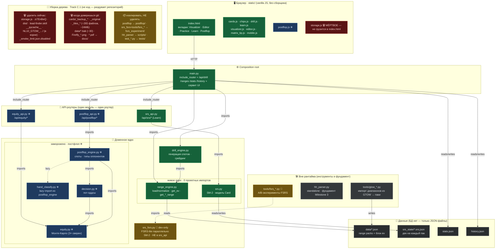

# Poker Trainer — Визуальная карта архитектуры

Создано: 2026-06-17. Это **визуализация** `docs/architecture.md` (слои §2 + инвентарь §3 +
чек-лист уборки §6) в виде одной Mermaid-диаграммы. Парные доки: `CLAUDE.md` (решения),
`roadmap.md` (треки), `problems.md` (баги).

Связи импортов сверены с кодом 2026-06-17 (`main.py`, `srs_api.py`, `postflop_engine.py`,
`index.html`): `storage.js` не подключён → мёртвый; `srs_api` импортит только `srs` (не
`srs_fsrs`) → FSRS dev-only; `postflop_engine` лениво тянет `hand_classify` → заморожено, но
живое; `hh_parser` никто не импортит → standalone.

> **Посмотреть крупно:** открой `docs/architecture_diagram.html` двойным кликом — браузерный
> вьюер с зумом (колесо мыши / ±), перетаскиванием и кнопкой «Скачать SVG». Диаграмма в нём
> побайтово та же, что в блоке ниже.

---

## Легенда

| Цвет | Статус | Значит |
|---|---|---|
| 🟢 зелёный | **живое** | меняется, в проде, под фокусом (префлоп) |
| 🔵 синий | **заморожено** ❄ | постфлоп — в репо, но не трогаем (CLAUDE.md, roadmap) |
| 🟡 жёлтый | **dev-only** 🧪 | эксперимент, НЕ подключён к API (`srs_fsrs`, `tools/fsrs_*`) |
| 🔴 красный | **мёртвое** 🗑 | удалить — рантайм не заметит |
| ⚪ серый | данные / инструменты | JSON-стейт, GTOW-импортёры, парсер |

**Правило стрелок:** зависимости идут строго вниз (верхний слой знает про нижний, не наоборот).
Это и есть признак здоровой слоёной архитектуры — `range_engine`/`srs`/`equity` ни от чего внутри
проекта не зависят (ядро с 0 импортов), всё остальное зависит от них.

---

## Диаграмма

---

## Как читать

- **Пять слоёв сверху вниз** — это весь рантайм: ~13 Python-модулей + 8 живых JS. Маленький,
  аккуратный проект; «огромным» дерево делают данные/бэкапы/дампы, а не код (см. `architecture.md` §1).
- **Зелёное** — то, что реально меняется (префлоп: Drill, Learn, Visualizer, Editor + ядро
  `range_engine`/`drill_engine`/`srs`). Сюда направлен фокус.
- **Синее ❄** — постфлоп целиком заморожен: остаётся в репо, подключён в `main`, но не трогается до
  стабилизации префлопа. `hand_classify` тоже синий — он НЕ мёртвый, его лениво импортит
  `postflop_engine` (удаление сломает постфлоп при разморозке — частая ошибка старых заметок).
- **Жёлтое 🧪** — FSRS-эксперимент: `srs_fsrs` существует параллельно SM-2 и сознательно НЕ
  подключён к `srs_api` (решение #11). Живой Learn остаётся на SM-2.
- **Красное 🗑** — `storage.js` единственный реально мёртвый код в рантайме.
- **Нижний блок 🧹** — это уборка *дерева*, а не кода: гигиена файлов из `architecture.md` §6.
  Делать маленькими партиями с прогоном тестов между ними; постфлоп и FSRS — изолировать в
  отдельные папки, не удалять.

## Что это даёт для «оптимизации»

Архитектура здоровая — переписывать нечего. Рычаги ровно три, по убыванию пользы/риска:

1. **Сгруппировать по роли** (нулевой риск): `tests/`, `app/`, изоляция `postflop/` и
   `fsrs_experiment/`. Перенос Python трогает импорты и `Dockerfile` → отдельной подзадачей с тестами.
2. **Выкинуть мусор дерева** (красный/серый блок) — освоить git как бэкап, перестать держать ручные
   снапшоты колоды и десятки `.bak`.
3. **Подрезать `CLAUDE.md`** — журнал импортов GTOW-паков (решение #13) увести в `roadmap.md`,
   принципы оставить. Always-on файл должен быть коротким.
