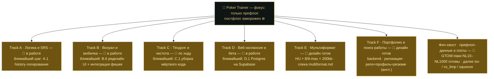
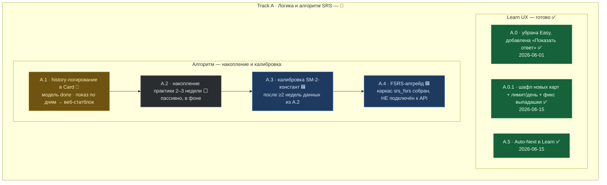
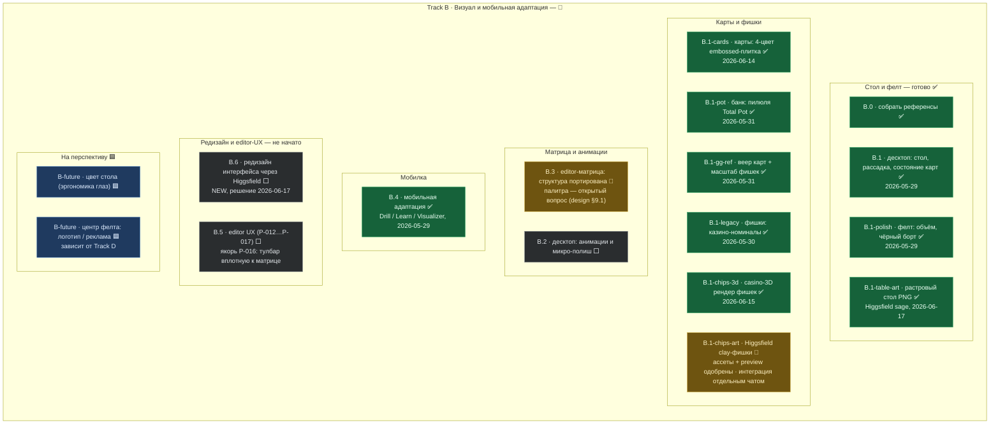
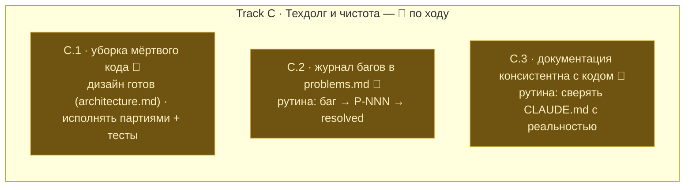
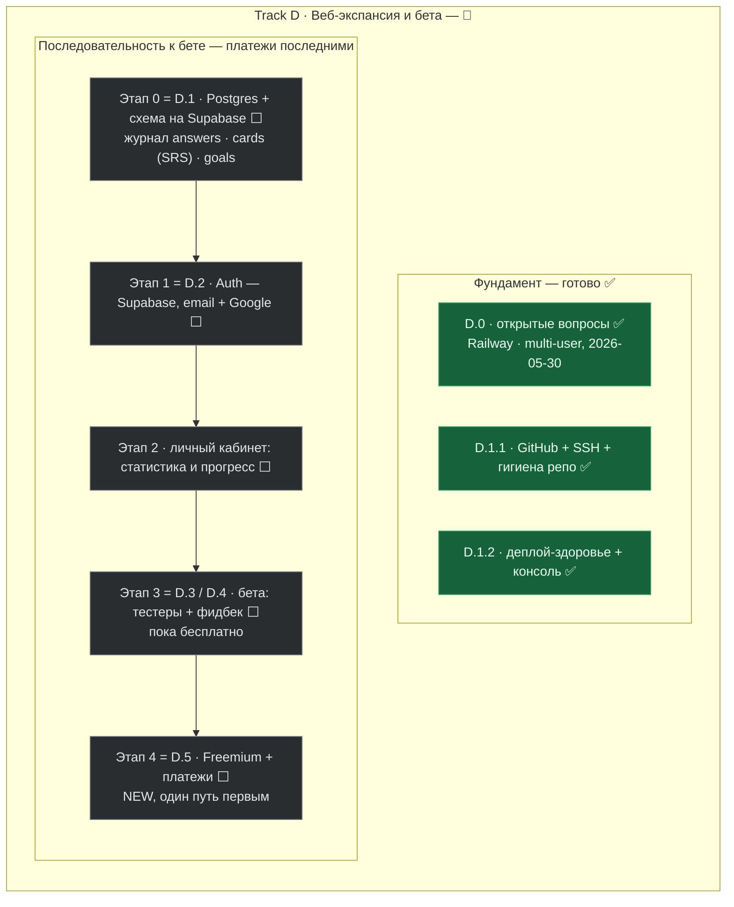
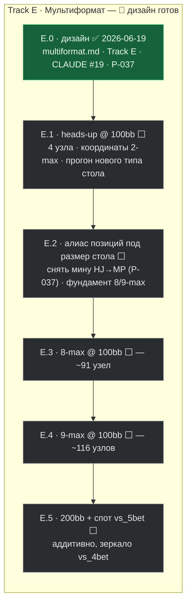
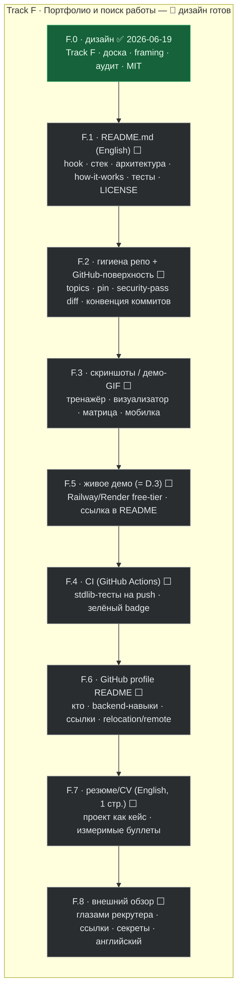
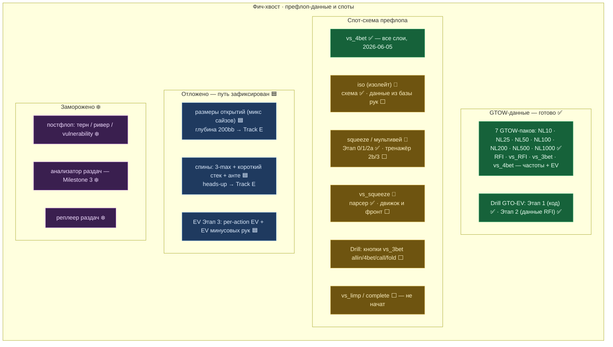

# Poker Trainer — Доска треков

Обновлено: 2026-06-19. Это **визуальная карта всех треков и задач** проекта — блок-схемами,
которые GitHub рисует сам (Mermaid). Источник истины по сути работы остаётся `docs/roadmap.md`;
эта доска — его «вид сверху» для отслеживания статусов. Парные доки: `CLAUDE.md` (решения),
`docs/problems.md` (баги), `docs/design.md` (визуал), `docs/architecture_diagram.md` (карта кода).

> **Как обновлять.** Когда статус подзадачи меняется — поменяй её эмодзи в подписи узла
> (✅/🔄/⬜/🟦/❄️) и её строку `class …` в конце нужного блока. Держи в синхроне с `roadmap.md`.

---

## Легенда статусов

| Цвет | Маркер | Статус | Значит |
|---|---|---|---|
| 🟢 зелёный | ✅ | **done** | сделано, в коде/проде |
| 🟡 золотой | 🔄 | **в работе** | активно / частично сделано / рутина |
| ⚪ серый | ⬜ | **не начато** | запланировано, ещё не начинали |
| 🔵 синий | 🟦 | **отложено** | сознательно отложено, путь зафиксирован |
| 🟣 фиолетовый | ❄️ | **заморожено** | в репо, но не трогаем (постфлоп, анализатор) |

**Текущий фокус: только префлоп.** Постфлоп заморожен целиком (код в репо, не трогается).

---

## Обзор — треки A–F + фич-хвост

---

## Track A — Логика и алгоритм SRS

Learn Mode MVP закрыт, SM-2-движок работает. UX-улучшения сделаны; дальше — накопление данных и
калибровка алгоритма по ним (не наугад).

---

## Track B — Визуал и мобильная адаптация

Стол, карты, фишки, банк, мобилка — сделаны. Открыто: интеграция Higgsfield-фишек, редизайн всего
интерфейса (B.6, новое), палитра матрицы и editor-UX. Принцип: роскошь в столе/картах, строгость
вокруг (см. `design.md`).

---

## Track C — Техдолг и чистота

Архитектура здоровая (чистые слои), задача — гигиена дерева, а не переписывание. Дизайн уборки
готов (`architecture.md`), исполнять маленькими партиями с прогоном тестов.

---

## Track D — Веб-экспансия и бета

Прод на Railway, авто-деплой из GitHub на `prefloprange.org`. Фундамент готов. Дальше — строгая
последовательность к бете; **платежи делаем последними**. Хранилище + авторизация = один сервис
**Supabase** (managed Postgres + Auth), решение 2026-06-17.

---

## Track E — Мультиформат: размеры столов + глубина

Дизайн готов (2026-06-19, спека `docs/multiformat.md`). Размер стола и глубина — свойства пака
(`meta` + `config.positions`); ветка = новые паки + точечные правки, не переписывание движков.
Анте вне ветки. Узлов на пак @100bb: HU 4 · 6-max 50 · 8-max 91 · 9-max 116.

---

## Track F — Портфолио и поиск работы

Технически проект сильный (тесты, equity-движок, чистая архитектура, data-пайплайн), но
презентационно невидим: нет README/LICENSE/демо/CI, доки на русском. Трек — про подачу под
backend-роль и релокацию (всё на английском), не про фичи. Опирается на Track D (демо = D.3,
БД-пробел закрывает D.1). Код не трогаем.

---

## Фич-хвост — параллельная работа (в основном префлоп-данные)

Это не отдельный «трек» из roadmap, а параллельная фич-работа: данные диапазонов из GTOW и
расширение спот-схемы префлопа. Заливка GTOW-паков по лимитам в основном закрыта; остаются iso
(не из GTOW), vs_limp и доборы squeeze.

---

## Сводка по трекам

| Трек | Тема | Статус | Ближайший шаг |
|---|---|---|---|
| **A** | Логика и алгоритм SRS | 🔄 в работе | A.1 — history-логирование (показ по дням → веб) |
| **B** | Визуал + мобильная адаптация | 🔄 в работе | B.6 редизайн UI / интеграция Higgsfield-фишек |
| **C** | Техдолг и чистота | 🔄 по ходу | C.1 — уборка мёртвого кода (партиями) |
| **D** | Веб-экспансия и бета | 🔄 в работе | D.1 — Postgres + схема на Supabase |
| **E** | Мультиформат: столы + глубина | 🔄 дизайн готов | E.1 — heads-up @ 100bb (`multiformat.md`) |
| **F** | Портфолио и поиск работы | 🔄 дизайн готов | F.1 — README (English) + LICENSE |
| **Фич-хвост** | Префлоп-данные и споты | 🔄 | iso (из базы рук), vs_limp, доборы squeeze |
